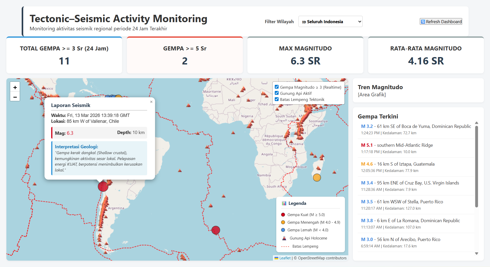

# 🌍 Tectonic–Seismic–Volcanic Monitoring Dashboard

**🌐 [VIEW LIVE DASHBOARD HERE](https://mnaufal52.github.io/seismicity-dashboard/)**

## 1. Project Overview
This project is an interactive Web GIS dashboard designed to monitor tectonic, seismic, and volcanic activity using open geoscience data. The dashboard integrates real-time earthquake events, tectonic plate boundaries, and volcanic locations to visualize Earth system interactions in a single interactive map environment.

## 2. Dashboard Preview

## 3. Methodology & Key Features
The dashboard was developed primarily using Vanilla JavaScript and the Leaflet.js library. Key features implemented include:
* **Dynamic Earthquake Rendering:** Dynamic styling of earthquake markers based on Magnitude rules.
* **Smart Dashboard Engine:** UI indicators (Total Quakes, Max Mag, Avg Mag) automatically update based on the map's current bounding box (viewport).
* **Geological Storytelling Popup:** An automated interpretation engine that analyzes earthquake depth, magnitude, and spatial distance (< 50km) to the nearest active volcano to provide on-the-fly geoscience insights.
* **Automated Data Curation:** JavaScript algorithms dynamically filter geospatial data to maintain lightweight and responsive browser rendering across devices.

## 4. Earth System Insights & Objectives
The objectives of this project are to visualize global earthquake activity in real-time, provide tectonic context using global plate boundary data, explore spatial relationships between earthquakes and volcanoes automatically, and demonstrate the integration of geoscience datasets in a Web GIS environment.

Analysis of the integrated datasets within this dashboard reveals several key geological patterns:
* **Tectonic Alignment:** Earthquake clusters align closely with major tectonic plate boundaries (e.g., Ring of Fire).
* **Volcanic Arcs:** Volcano distribution strongly follows subduction-related volcanic arcs.
* **Tectonic-Volcanic Interaction:** The system successfully flags moderate-to-strong earthquakes occurring near volcanic regions (< 50km), suggesting possible magmatic interactions.
* **Subduction Dynamics:** Intermediate and deep-focus earthquakes are accurately identified along subduction zones, reflecting descending slab processes.

## 5. Data Sources
* **Earthquake Data:** USGS Earthquake API (Real-time GeoJSON).
* **Tectonic Plate Boundaries:** Global Plate Boundary Dataset.
* **Volcano Data:** Global Volcanism Program - Holocene Volcanoes (Smithsonian Institution).

## 6. Technologies Used
* HTML5 / CSS3 (CSS Grid & Flexbox)
* JavaScript (ES6, Array Processing, Fetch API)
* Leaflet.js (Web Mapping Library)
* GeoJSON Data Handling

## 7. Project Significance
This project demonstrates the integration of geospatial data, earth science interpretation, and interactive Web GIS development. It highlights how multiple Earth system datasets can be combined to support geological monitoring and spatial analysis, bridging the gap between Data Engineering and Geoscience. This foundational framework in spatial modeling and volcanic monitoring serves as a robust stepping stone for advanced Earth observation research, including multi-temporal surface deformation analysis.
